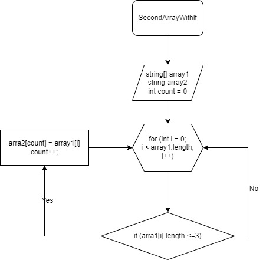

# Контрольная работа

## Задача :
**Написать программу, которая из имеющегося массива строк формирует массив из строк, длина которых меньше либо равна 3 символа. Первоначальный массив можно ввести с клавиатуры, либо задать на старте выполнения алгоритма. При решение не рекомендуется пользоваться коллекциями, лучше обойтись исключительно массивами.**

## Описание алгоритма решения:

*Объявляем два массива одинокавой длины. Запускаем цикл в котором будем проверять условие (<=3), если "**да**" элемент первого массива заносится в count элемент второго массива. Переменная count создана, чтобы поочередно вносить строки из первого массива во второй и чтобы потом не было пробелов. После присвоения увеличивается переменная count на 1 и возвращается к циклу for в котором i увеличивается на 1. И так проверяется до конца.*

+ __Блок схема__

+ __Реализация алгоритма по пути KZ/Program.cs__